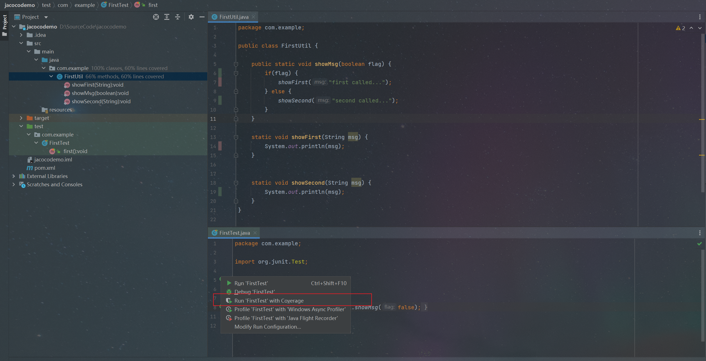
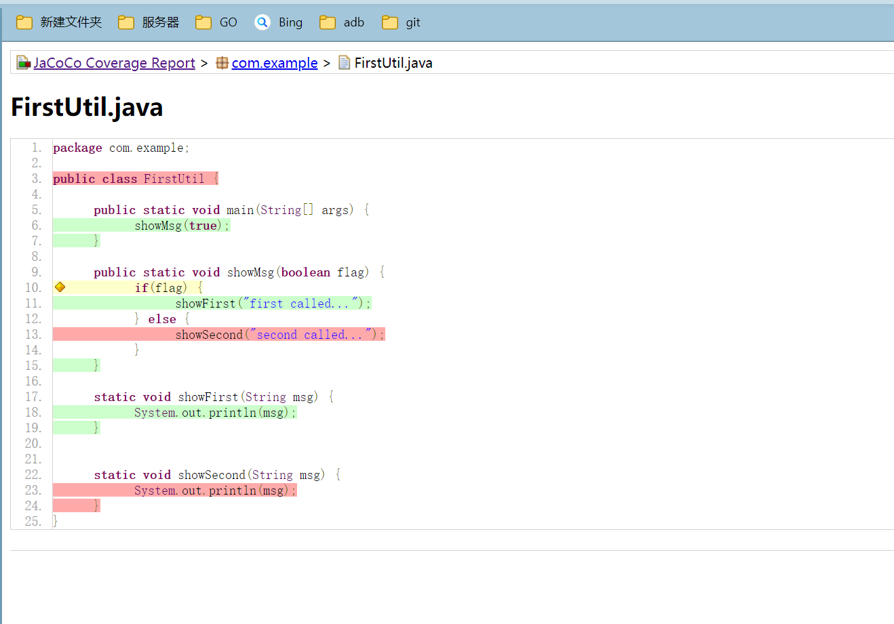
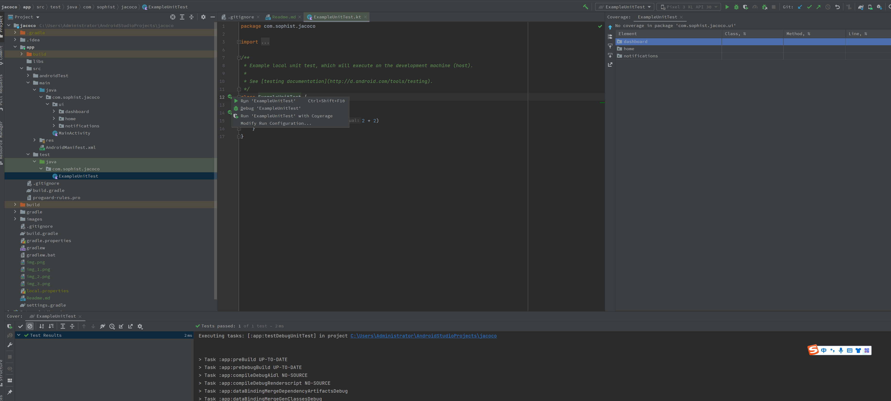
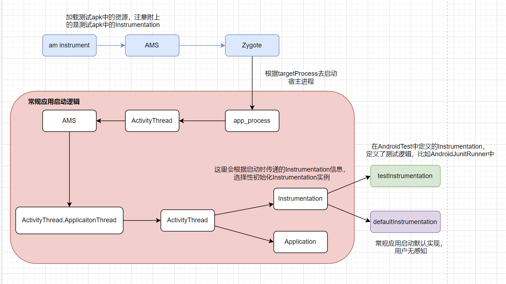

# 从单元测试到Android覆盖率（Jacoco使用）
## 背景
在惊醒质量保障时，为了量化测试质量，可以选择代码覆盖率作为量化指标之一。代码覆盖率，也成为测试覆盖率，可衡量自动化测试执行的代码比例。
代码覆盖率工具针对特定的编程语言，其使用一系列标准衡量覆盖率，包括代码行数、分发或函数、分支和条件。检测代码覆盖率指标有助于保持自动化
测试水平，如果代码覆盖率有所下降，则可能表明没有将自动化测试作为编写新代码的核心要素。
然而，虽然代码覆盖率能够说明测试覆盖率多少代码，但它并不会指示这些测试的有效性或其能否解决所有故障模式。
下面便从Java上的覆盖率收集说起，主要覆盖常见的几种常见说明覆盖率收集方案。

## 覆盖率实践
### 单元测试覆盖率
对于Java程序，如果想要对其进行单元测试，比如在Idea继承环境下，是非常简单的。
- 业务代码和测试代码隔离，测试代码可直接调用业务代码编写测试逻辑


  
- 运行命令分析
```shell
"C:\Program Files\Java\jdk1.8.0_321\bin\java.exe" 
  -ea -javaagent:C:\Users\Administrator\AppData\Local\JetBrains\IntelliJIdea2021.3\testAgent\intellij-coverage-agent-1.0.613.jar=C:\Users\Administrator\AppData\Local\Temp\coverage2args 
  -Didea.new.sampling.coverage=true 
  -Dcoverage.ignore.private.constructor.util.class=true 
  -Didea.test.cyclic.buffer.size=1048576 "-javaagent:C:\Program Files\JetBrains\IntelliJ IDEA 2021.3.2\lib\idea_rt.jar=50867:C:\Program Files\JetBrains\IntelliJ IDEA 2021.3.2\bin" 
  -Dfile.encoding=UTF-8 
  -classpath "C:\Program Files\JetBrains\IntelliJ IDEA 2021.3.2\lib\idea_rt.jar;
              C:\Program Files\JetBrains\IntelliJ IDEA 2021.3.2\plugins\junit\lib\junit5-rt.jar;
              C:\Program Files\JetBrains\IntelliJ IDEA 2021.3.2\plugins\junit\lib\junit-rt.jar;
              C:\Program Files\Java\jdk1.8.0_321\jre\lib\charsets.jar;
              C:\Program Files\Java\jdk1.8.0_321\jre\lib\deploy.jar;
              C:\Program Files\Java\jdk1.8.0_321\jre\lib\ext\access-bridge-64.jar;
              C:\Program Files\Java\jdk1.8.0_321\jre\lib\ext\cldrdata.jar;
              C:\Program Files\Java\jdk1.8.0_321\jre\lib\ext\dnsns.jar;
              C:\Program Files\Java\jdk1.8.0_321\jre\lib\ext\jaccess.jar;
              C:\Program Files\Java\jdk1.8.0_321\jre\lib\ext\jfxrt.jar;
              C:\Program Files\Java\jdk1.8.0_321\jre\lib\ext\localedata.jar;
              C:\Program Files\Java\jdk1.8.0_321\jre\lib\ext\nashorn.jar;
              C:\Program Files\Java\jdk1.8.0_321\jre\lib\ext\sunec.jar;
              C:\Program Files\Java\jdk1.8.0_321\jre\lib\ext\sunjce_provider.jar;
              C:\Program Files\Java\jdk1.8.0_321\jre\lib\ext\sunmscapi.jar;
              C:\Program Files\Java\jdk1.8.0_321\jre\lib\ext\sunpkcs11.jar;
              C:\Program Files\Java\jdk1.8.0_321\jre\lib\ext\zipfs.jar;
              C:\Program Files\Java\jdk1.8.0_321\jre\lib\javaws.jar;
              C:\Program Files\Java\jdk1.8.0_321\jre\lib\jce.jar;
              C:\Program Files\Java\jdk1.8.0_321\jre\lib\jfr.jar;
              C:\Program Files\Java\jdk1.8.0_321\jre\lib\jfxswt.jar;
              C:\Program Files\Java\jdk1.8.0_321\jre\lib\jsse.jar;
              C:\Program Files\Java\jdk1.8.0_321\jre\lib\management-agent.jar;
              C:\Program Files\Java\jdk1.8.0_321\jre\lib\plugin.jar;
              C:\Program Files\Java\jdk1.8.0_321\jre\lib\resources.jar;
              C:\Program Files\Java\jdk1.8.0_321\jre\lib\rt.jar;
              D:\SourceCode\jacocodemo\target\test-classes;
              D:\SourceCode\jacocodemo\target\classes;
              C:\Users\Administrator\.m2\repository\junit\junit\4.13.1\junit-4.13.1.jar;
              C:\Users\Administrator\.m2\repository\org\hamcrest\hamcrest-core\1.3\hamcrest-core-1.3.jar" 
  com.intellij.rt.junit.JUnitStarter
  -ideVersion5 
  -junit4 
  com.example.FirstTest
```
a.业务代码调用测试代码原因，是业务代码在classpath类路径中
b.javaagent参数指向内容完成覆盖率收集
c.实际上是在构建主机上启动JVM拉起JUnitStarter(有Main方法)，并指定测试类com.example.FirstTest触发测试


看执行命令
```shell
"C:\Program Files\Java\jdk1.8.0_321\bin\java.exe" 
-javaagent:C:\Users\Administrator\AppData\Local\JetBrains\IntelliJIdea2021.3\testAgent\intellij-coverage-agent-1.0.613.jar=C:\Users\Administrator\AppData\Local\Temp\coverage7args 
-Didea.new.sampling.coverage=true 
-Dcoverage.ignore.private.constructor.util.class=true "-javaagent:C:\Program Files\JetBrains\IntelliJ IDEA 2021.3.2\lib\idea_rt.jar=51008:C:\Program Files\JetBrains\IntelliJ IDEA 2021.3.2\bin" 
-Dfile.encoding=UTF-8 
-classpath "C:\Program Files\Java\jdk1.8.0_321\jre\lib\charsets.jar;
        C:\Program Files\Java\jdk1.8.0_321\jre\lib\deploy.jar;
        C:\Program Files\Java\jdk1.8.0_321\jre\lib\ext\access-bridge-64.jar;
        C:\Program Files\Java\jdk1.8.0_321\jre\lib\ext\cldrdata.jar;
        C:\Program Files\Java\jdk1.8.0_321\jre\lib\ext\dnsns.jar;
        C:\Program Files\Java\jdk1.8.0_321\jre\lib\ext\jaccess.jar;
        C:\Program Files\Java\jdk1.8.0_321\jre\lib\ext\jfxrt.jar;
        C:\Program Files\Java\jdk1.8.0_321\jre\lib\ext\localedata.jar;
        C:\Program Files\Java\jdk1.8.0_321\jre\lib\ext\nashorn.jar;
        C:\Program Files\Java\jdk1.8.0_321\jre\lib\ext\sunec.jar;
        C:\Program Files\Java\jdk1.8.0_321\jre\lib\ext\sunjce_provider.jar;
        C:\Program Files\Java\jdk1.8.0_321\jre\lib\ext\sunmscapi.jar;
        C:\Program Files\Java\jdk1.8.0_321\jre\lib\ext\sunpkcs11.jar;
        C:\Program Files\Java\jdk1.8.0_321\jre\lib\ext\zipfs.jar;
        C:\Program Files\Java\jdk1.8.0_321\jre\lib\javaws.jar;
        C:\Program Files\Java\jdk1.8.0_321\jre\lib\jce.jar;
        C:\Program Files\Java\jdk1.8.0_321\jre\lib\jfr.jar;
        C:\Program Files\Java\jdk1.8.0_321\jre\lib\jfxswt.jar;
        C:\Program Files\Java\jdk1.8.0_321\jre\lib\jsse.jar;
        C:\Program Files\Java\jdk1.8.0_321\jre\lib\management-agent.jar;
        C:\Program Files\Java\jdk1.8.0_321\jre\lib\plugin.jar;
        C:\Program Files\Java\jdk1.8.0_321\jre\lib\resources.jar;
        C:\Program Files\Java\jdk1.8.0_321\jre\lib\rt.jar;
        D:\SourceCode\jacocodemo\target\classes" 
com.example.FirstUtil
```
a.业务代码调用测试代码原因，是业务代码在classpath类路径中
b.javaagent参数指向内容完成覆盖率收集
c.实际上是在构建主机上启动JVM拉起FirstUtil(有Main方法)

- 基于Java的javaagent参数分析
  https://www.cnblogs.com/rickiyang/p/11368932.html
实际上可以简单理解为，javaagent是JVM提供的标准API（底层使用Java instrument等api），用于在JVM的类加载器加载class文件之前对class进行拦截，对字节码文件进行修改，使得加载到内存中的字节码文件是修改过后的字节码内容。
  
- javaagent参数指向jar包----jacoco及其衍生物
官网：https://www.jacoco.org/jacoco/trunk/index.html
简要说明一下，jacoco官网提供了三个jar包：
  - jacocoagent.jar，满足JVM javaagent参数启动要求，会在类加载时对字节码进行修改，主要是进行覆盖率收集，获取覆盖率原始文件。需要依附于JVM进程，在Javaagent参数后附加上；
  - jacococli.jar，主要是及逆行覆盖率数据合并、解析，以及字节码插桩等操作，作为独立JVM运行；
  - jacocoant.jar，主要是与ant构建工具配合使用，一般工程用不上
针对上面前面两个jar包，主要是会有两种覆盖率采集方案，on-the-fly和offline模式，差异如下：
  - on-the-fly，启动Java虚拟机时，通过javaagent指定jacocoagent.jar，在类加载时，对类进行插桩处理，属于运行期插桩和覆盖率收集，前面单元测试即是这种情况；
  - offline，针对无法传递javaagnet参数的非标准JVM虚拟机，先通过jacococli.jar在编译期对字节码进行插桩处理，属于百年一起插桩、运行期覆盖率收集。
实际上，两类插桩逻辑最终操作都是针对字节码进行插桩，只是处理时期不同，一个在运行期，一个在编译器。
    
### Java程序覆盖率收集
- 先打jar包

  
- 按照javaagent参数要求执行jar包
```text
javaagent参数需要在执行的jar参数之前
javaagent的接具体javacocoagent是以":"分割
javaagent的各个参数都以=key1=value1[,key2=value2]
```

举例：
```shell
java 
  -javaagent:D:\UserLibrary\jacoco-0.8.7\lib\jacocoagent.jar 
  -jar .\jacocodemo.jar
```

- 覆盖率文件收集方式
  a.JVM退出时，默认行为，JVM退出的hook
  b.通过tcp端口拉去数据，服务器常见，官网有示例
  c.主动导出，Android中常见

- 解析覆盖率

举例：
```shell
java 
  -jar D:\UserLibrary\jacoco-0.8.7\lib\jacococli.jar 
  report .\jacoco.exec 
  --classfiles D:\SourceCode\jacocodemo\target\classes 
  --html ./report
```

- 结合源码分析覆盖率

  举例：
```shell
java 
  -jar D:\UserLibrary\jacoco-0.8.7\lib\jacococli.jar 
  report .\jacoco.exec 
  --classfiles D:\SourceCode\jacocodemo\target\classes 
  --sourcefiles D:\SourceCode\jacocodemo\src\main\java
  --html ./report
```

### Android覆盖率
#### 单元测试
原理和idea中类似，也是构建主机上拉起JVM执行测试代码，只是会以gradle task的形式展示，无法查看具体调用。


#### AndroidTest测试

从中可以看出，AndroidTest测试，实际上就是在Android系统上启动宿主进程进行测试的。进程启动过程完全受AMS调控，因此，无法使用javaagent参数。
更深层次说明：Android应用运行环境，Android Runtime(ART)并不是标准的JVM虚拟机。因此，无法使用on-the-fly模式，在运行期通过javaagent来
动态插桩。只能够通过编译期进行插桩，这样会有很多插桩代码，体积会变大。这里可以看出，实际上AndroidTest测试和宿主应用的测试都是ART环境，所以讨论覆盖率问题，
就直接使用宿主应用进行说明。

#### 宿主应用测试
由于需要编译期对字节码进行插桩，即offline模式。而对于Android application和library都是通过android gradle plugin控制编译流程的，并且是支持字节码插桩的。
- 打开覆盖率开关
```groovy

android {
    
    buildTypes {
        release {
            // 下面这个控制字节码插桩
            testCoverageEnabled true
            minifyEnabled false
            proguardFiles getDefaultProguardFile('proguard-android-optimize.txt'), 'proguard-rules.pro'
        }
    }
}
```
- 覆盖率文件收集
offline模式，没有进程退出收集覆盖率的逻辑。因此，都是通过主动收集覆盖率数据的。
参考jacocoagent.jar中Agent的API，如何收集覆盖率数据。
  
- 查看字节码插桩

